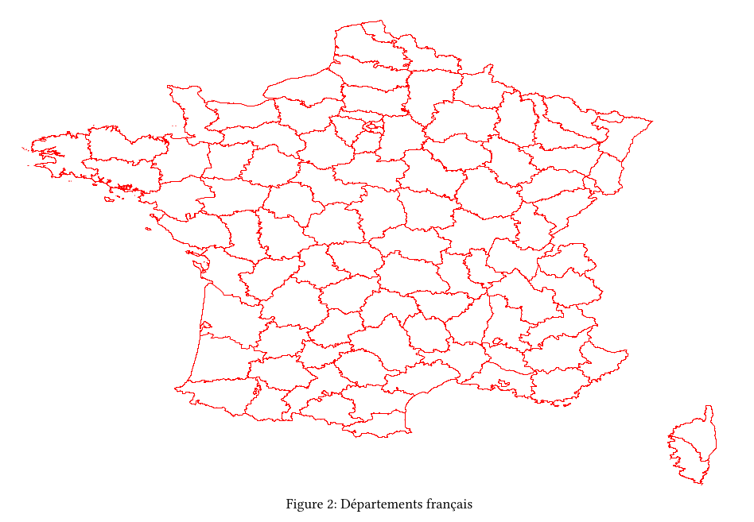

# mercator

Mercator is a typst plugin to render GeoJSON as SVG in typst.

# build locally

```sh
cargo build --target wasm32-unknown-unknown --release 
wasm-opt -O4 --enable-bulk-memory --strip-debug \
target/wasm32-unknown-unknown/release/mercator.wasm -o mercator/mercator.wasm
cp -r mercator/* ~/.local/share/typst/packages/local/mercator/0.1.1/
```

# usage

````typst
#import "@preview/mercator:0.1.1"

// inline

#let config = json.encode((
  "stroke": "black",
  "stroke_width": 0.02,
  "fill": "green",
  "fill_opacity": 0.5,
  "viewbox": array((10.0, -70.0, 5.0, 5.0))))

#show raw.where(lang: "geojson"): it => mercator.render-map(it.text, config, width: 400pt)

```geojson
<GeoJSON string>
```

// from file

#let france = read(
  "departements_fr.json",
  encoding: "utf8",
)

#let config3 = json.encode((
  "stroke": "red",
  "stroke_width": 0.005,
  "fill": "white",
  "fill_opacity": 0.5,
  "viewbox": array((-5.0, -54.0, 15.0, 14.6))))

#figure(mercator.render-map(france, config3, width:550pt, height: 400pt), caption: "Départements français")
````

# example

```sh
typst compile mercator/example/example.typ
```



Check the source of [example.typ](mercator/examples/basic/example.typ) & the result [example.pdf](mercator/examples/basic/example.pdf).

# optimization benchmarks: 

* normal: `typst compile mercator/examples/france/all_france.typ  675.27s user 1.92s system 104% cpu 10:46.13 total`
* basic opti with wasm-opt: `typst compile mercator/examples/france/all_france.typ  653.37s user 1.41s system 105% cpu 10:19.52 total`
* rust side opti (2) + wasm-opt: `typst compile mercator/examples/france/all_france.typ  538.37s user 1.76s system 106% cpu 8:25.55 total`
* rust (3) + wasm-opt: `typst compile mercator/examples/france/all_france.typ  523.40s user 1.66s system 107% cpu 8:09.52 total`