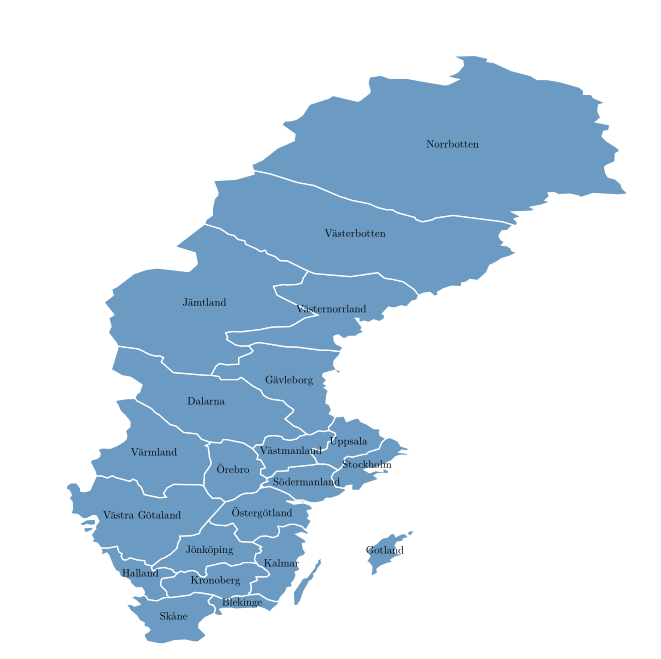

# mercator

Mercator is a typst plugin to render GeoJSON as SVG in typst.

# build locally

```sh
cargo build --target wasm32-unknown-unknown --release
wasm-opt -O4 --enable-bulk-memory --strip-debug \
target/wasm32-unknown-unknown/release/mercator.wasm -o mercator/mercator.wasm
```

# usage

```sh
#import "@preview/mercator:0.1.2"

#let sweden = read("data/swedish_regions.json", encoding: "utf8")

#let sweden_config = json.encode((
  stroke: "white",
  stroke_width: 0.03,
  fill: "steelblue",
  fill_opacity: 0.8,
  label: "{name}",
  label_color: "black",
  label_font_size: 0.25,
))

render-map(sweden, sweden_config, width: 80%)
```

Produces:



# config options

| Option | Type | Default | Description |
|--------|------|---------|-------------|
| `stroke` | string | `"black"` | Stroke color. Use `{property_name}` to read from each feature's GeoJSON properties (see [per-feature styling](#per-feature-styling)). |
| `stroke_width` | float | `0.05` | Stroke width |
| `fill` | string | `"red"` | Fill color. Use `{property_name}` to read from each feature's GeoJSON properties (see [per-feature styling](#per-feature-styling)). |
| `fill_opacity` | float | `0.5` | Fill opacity |
| `viewbox` | array | auto | Viewbox as `(x, y, width, height)`. Auto-computed from GeoJSON bounds if omitted. |
| `viewbox_padding` | float | `0.1` | Padding around auto-computed viewbox (as fraction of width/height). Only used when `viewbox` is not set. |
| `label` | string or array | none | Label template. Simple: `"{name}"`. Multi-line: `[{"text": "{name}", "font_size": 0.4}, {"text": "{code}", "font_size": 0.2}]` |
| `label_color` | string | `"black"` | Default label color |
| `label_font_size` | float | `0.3` | Default label font size |
| `label_font_family` | string | `"Arial"` | Default label font family |
| `fill_pattern` | string | none | Fill pattern: `"hatched"`, `"crosshatched"`, or `"dotted"`. Uses `fill` color for the pattern. Supports `{property_name}` interpolation. |
| `point_radius` | float | `stroke_width * 5` | Radius for Point/MultiPoint geometries |

## per-feature styling

Use `{property_name}` in `fill` or `stroke` to resolve values from each feature's GeoJSON properties:

```typst
#let config = json.encode((
  "stroke": "black",
  "stroke_width": 0.02,
  "fill": "{fill_color}",
  "fill_opacity": 0.6,
  "label": "{name}"))
```

If a feature is missing the referenced property, the fill falls back to `"none"` and the stroke falls back to `"black"`.

# example

```sh
typst compile --root . examples/example.typ
```

Check the source of [example.typ](examples/example.typ) and its result [example.pdf](examples/example.pdf).