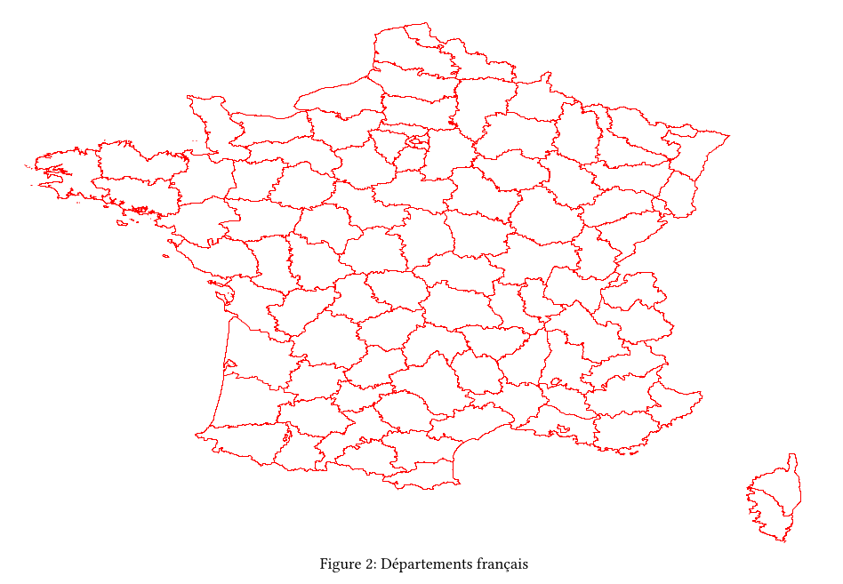

# Mercator

Mercator is a typst package to render GeoJSON in typst documents.

## Usage

````typst
#import "@preview/mercator:0.1.0"

#show raw.where(lang: "geojson"): it => mercator.render-map(it.text, config, width: 400pt)

// inline

#let config = json.encode((
  "stroke": "black",
  "stroke_width": 0.02,
  "fill": "green",
  "fill_opacity": 0.5,
  "viewbox": array((10.0, -70.0, 15.0, 15.0))))

```geojson
<GeoJSON>
```

// from file

#let france = read(
  "departements_fr.json",
  encoding: "utf8",
)

#let config3 = json.encode((
  "stroke": "red",
  "stroke_width": 0.005,
  "fill": "white",
  "fill_opacity": 0.5,
  show_labels: false))

#figure(mercator.render-map(france, config3, width:550pt, height: 400pt), caption: "Départements français")

````

# API 

The [render-map(code, config, ..args)](mercator/mercator.typ) function has 2+ arguments:

* code: GeoJSON data

* config: The config to modify how the map will be rendered

```json
{
  stroke: "black",
  stroke_width: 0.05,
  fill: "red",
  fill_opacity: 0.5,
  viewbox: None,
  label_color: "black",
  label_font_size: 0.3,
  label_font_family: "Arial",
  show_labels: true,
}
```

These are the default config values, `viewbox`, `label_color`, `label_font_size`, `label_font_family`, `show_labels` fields are Optional and can be omitted in the config.

NB: When `viewbox` is omitted or set to None, it is automatically computed via the GeoJSON coordinates to render the whole map.

* ..args: Remaining arguments passed to [image.decode](https://typst.app/docs/reference/visualize/image/)

# example



Check the source of [example.typ](example/example.typ) & the result [example.pdf](example/example.pdf).

